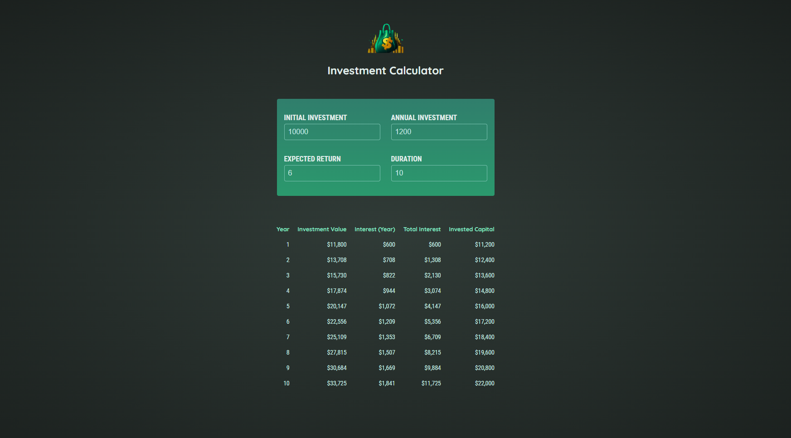

# Investment Calculator

This is a simple **Investment Calculator** built with **React** that allows users to input their financial data and calculate the investment results based on their initial investment, annual investment, expected return, and duration.

## Features

- Input fields for:
  - Initial Investment
  - Annual Investment
  - Expected Return (as a percentage)
  - Duration (in years)
- Investment results displayed in a table, showing:
  - Year
  - Investment Value at the end of the year
  - Interest for the year
  - Total Interest
  - Invested Capital

## Getting Started

To get the project up and running on your local machine, follow these steps:

### Prerequisites

- **Node.js** and **npm** installed.
- Clone the repository to your local machine.

### Installation

1. Clone the repository:

   ```bash
   git clone https://github.com/yourusername/investment-calculator.git
   cd investment-calculator
   ```

2. Install dependencies using **npm** or **Yarn**:

   ```bash
   npm install
   # or if you're using Yarn:
   yarn install
   ```

3. Start the development server:

   ```bash
   npm start
   # or with Yarn:
   yarn start
   ```

4. Open your browser and go to `http://localhost:5173` to view the Investment Calculator in action.

## Usage

### User Input

- **Initial Investment**: The amount of money you're starting with.
- **Annual Investment**: The amount you will contribute each year.
- **Expected Return**: The annual expected return rate in percentage.
- **Duration**: The number of years you plan to invest.

### Results

Once the user has entered their data, the results will be calculated and displayed in a table, showing the progress of the investment year by year, including the total interest and invested capital.

## Styles

This project uses a simple CSS file (`index.css`) to style the input fields, labels, and the results table.


## License

This project is licensed under the MIT License.

## Screenshot

